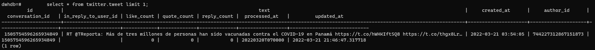
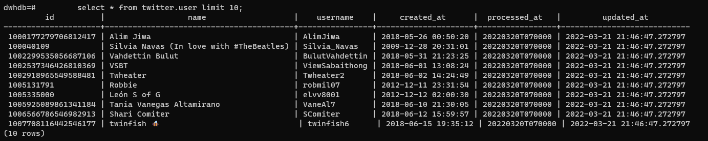

# Case serasa

## O Problema :D
Este case tem como objetivo realizar a ingestão de dados do twitter como fonte
com a funcionalidade de buscar por hashtags, por exemplo, #covid19
Os dados deverão ser armazedor em parquet

Como objetivo final espera-se: um datalake para que seja possível consolidar dados analíticos por hashtag e posteriormente consultar informações coletadas de forma batch / online.

## Arquitetura :P

### Ambiente Local

## 1 - A API do Twitter :)

### 1.1 - Como configura-la
    1. - Crie uma conta em: https://twitter.com, e então acesse https://developer.twitter.com/en, preencha algumas informações sobre seu perfil de desenvolvedor. 
    Link para ajudar: https://medium.com/programadores-ajudando-programadores/api-do-twitter-criando-o-app-e-obtendo-os-tokens-28ef3e2a281c
    2. - Crie seu app e guarde o Bearer token em um local seguro

## 2 - O projeto :O

### 2.1 - Executando o projeto

    1 - Tenha o docker instalado https://www.docker.com/products/docker-desktop, se estiver no windows você precisará ter o wsl instalado
    2. - Abra um terminal de sua preferência e execute:
        
        git clone https://github.com/costalauro/serasa-case.git
        cd serasa-case/docker/docker-airflow
        docker build --rm --force-rm -t docker-serasa-case .
        cd ../
        docker-compose up
        docker-compose up -d
        
    3. No docker desktop acessar o a opção browser do conteiner airflow web server ou digite http://localhost:8282/
    4. Faça login no airflow usando airflow e airflow no usuário e senha (se necessário)
    
    5. Adicione uma nova conexão para o twitter:

        conn_id: twitter_default

        Conn Type: http

        Host: https://api.twitter.com

        Extra: 
        {"Authorization": "Bearer <cole aqui o a string que você salvou anteriormente, você salvou né?  ò-ó> "}

    6. Adicione uma nova conexão para o spark:

        conn_id: spark_default

        Host: spark://spark

        Port: 7077

		Extra: {"queue": "root.default"}

    7.  Adicione uma nova conexão para o postgres dw local:

        conn_id: postgres_local

		Conn Type: Postgres

        Host: postgresdw

        schema: dwhdb

        user: dwhdb

        password: dwhdb
        
    8. Execute a dag ativando o botão de off pra on:

    9.  Execute os comandos abaixo para verificar se os dados foram criados dentro do conteiner postgresdw na opção CLI

        psql dwhdb dwhdb
        select * from twitter.tweet limit 10;

        select * from twitter.user limit 10;

    10. Agora temos 2 tabelas com dados deduplicados e consistentes prontos para consumo por uma api flask, ou uma data viz etc

## 3 - O que faltou:

    1. Testes unitários
        De certa forma fico tranquilo quanto a falta de testes unitários pois o airflow permite o teste integrado da solução de uma forma muito clara, mas ainda assim acredito que faltou externalizar algumas das funcionalidades em classes/pacotes  com testes para que no futuro pudessem ser utilizadas em outras dags
    2. API Rest
        Faltou uma API para consultar o DW postgresql criado, nela poderia rodar um modelo nlp em cima das mensagens do banco
    3. Data viz/Interatividade
        Poderia ter serviço local de data viz para visualização gráfica das tabelas, ou algo interativo como o jupyter notebook
    4. Streaming
        Poderia ter sido mais desruptivo e ter feito um pipeline que utiliza-se um cluster kafka local, mas isso levaria muito tempo
    5. Modelagem do DW
        Faltou :(
    6. Algo de CI/CD local, talvez simular uma esteira jenkins

## 4 - Deploy em produção:
    Acredito que a arquitetura abaixo atenda o case perfeitamente:
## Arquitetura - TO BE
