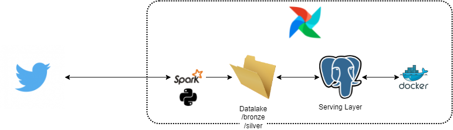

# Case serasa

## O Problema :D
Este case tem como objetivo realizar a ingestão de dados do twitter como fonte
com a funcionalidade de buscar por hashtags, por exemplo, #covid19
Os dados deverão ser armazedor em parquet

Como objetivo final espera-se: um datalake para que seja possível consolidar dados analíticos por hashtag e posteriormente consultar informações coletadas de forma batch / online.

## Arquitetura :P

### Ambiente Local

### Arquitetura - TO BE

## 1 - A API do Twitter :)

### 1.1 - Como configura-la
    1. - Crie uma conta em: https://twitter.com, e então acesse https://developer.twitter.com/en, preencha algumas informações sobre seu perfil de desenvolvedor. 
    Link para ajudar: https://medium.com/programadores-ajudando-programadores/api-do-twitter-criando-o-app-e-obtendo-os-tokens-28ef3e2a281c
    2. - Crie seu app e guarde o Bearer token em um local seguro

## 2 - O projeto :O

### 2.1 - Executando o projeto

    1 - Tenha o docker instalado https://www.docker.com/products/docker-desktop, se estiver no windows você precisará ter o wsl instalado
    2. - Abra um terminal de sua preferência e execute:
        
        git clone https://github.com/costalauro/serasa-case.git
        cd serasa-case/docker/docker-airflow
        docker build --rm --force-rm -t docker-serasa-case .
        cd ../
        docker-compose up
        docker-compose up -d

    3. No docker desktop acessar o a opção browser do conteiner airflow web server
    4. Faça login no airflow usando airflow e airflow no usuário e senha
    5. Adicione uma nova conexão:
        conn_id: twitter_default
        Conn Type: http
        Host: https://api.twitter.com
        Extra: 
        {"Authorization": "Bearer <cole aqui o a string que você salvou anteriormente, você salvou né?  ò-ó> "}
    6. Adicione uma nova conexão:
        conn_id: spark_default
		Conn Type:
        Host: spark://spark
        Port: 7077
		Extra: {"queue": "root.default"}

## Folders

The following tasks are available on make: